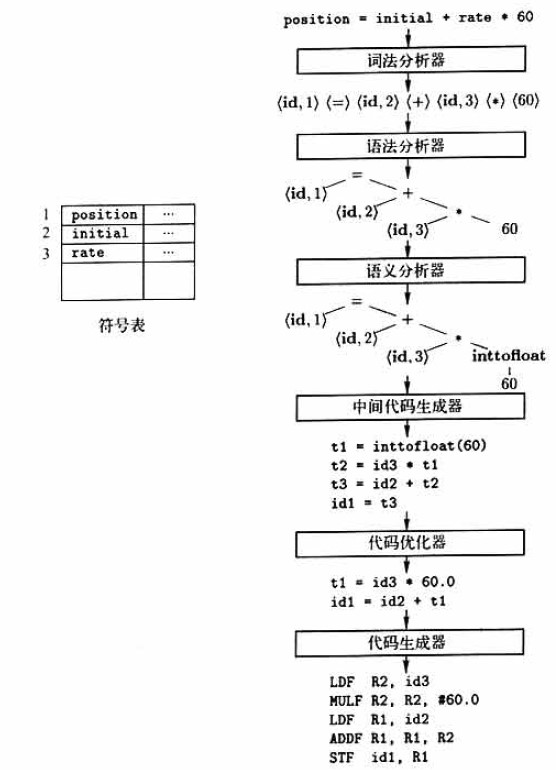

# 编译器和解释器之间的区别？
编译器：将源程序阅读并翻译成目标语言的程序。重要任务之一就是报告翻译过程中发现的错误。
解释器：不通过翻译源程序生成目标程序，直接利用用户的输入执行源程序中的操作。

区别在于：
- 编译器起到是翻译源程序的作用，通过翻译器产生的目标语言程序比解释器快的多。
- 解释器是起到执行源程序作用，错误诊断效果比编译器好的多。

# 编译器生成汇编程序而不是机器代码的原因是什么？
- 汇编语言容易输出和调试，能够生成可重定位的机器代码。

# 编译器的结构
翻译过程分为两个部分：
- 分析部分：（前端）
    - 将源程序分解为多个组成要素，并在要素上加上语法结构，然后使用这个结构来创建一个源程序的中间表示。
    - 检查语法、语义是否正确，并提供有用信息
    - 收集源程序的信息，将信息存放在一个称为符号表的数据结构中。
    - 符号表和中间表示一起传送给综合部分。
- 综合部分：（后端）
    - 根据中间表示和符号表中的信息构造目标程序。

# 编译器的步骤
--(字符流)-->词法分析器--(符号流)-->语法分析--(语法树)-->语义分析--(语法树)-->中间代码生成器--(中间表示形式)-->机器无关代码优化器--(中间表示形式)-->代码生成器--(目标机器语言)-->机器相关代码优化器--(目标机器语言)-->

## 1.词法分析
- 将读入的源程序字符流组成有意义的词素的序列。
- 对于每一个词素，语法分析器产生如下形式的词法单元：
    - 词法单元:<token-name,attribute-value>
        - token-name:语法分析使用的抽象符号
        - attribute-value：指向符号表中词法单元的条目。
            - 符号表条目信息被语义分析和代码生成使用
举列：
```c
position = initial + rate * 60;
```
- `position`是一个词素，被映射成词法单元<id,1>
    - id:标识符的抽象符号
    - 1：指向符号表中position对应的条目。
        - 标识符看对应的符号条目存放该标识符有关的信息，如类型和名字
- `=`是一个词素，被映射成<=>。不需要属性值，所以省略第二个分量
- `initial`是一个词素，被映射成词法单元<id,2>
- `+`是一个词素，被映射成<+>
- `rate`是一个词素，被映射成<id,3>
- `*`是一个词素，被映射成<*>
- `60`是一个词素，被映射成<60>
    - 应该是形如<number,4>的词法单元。
空格会被词法分析器直接忽略掉。

经过词法分析后---><id,1><=><id,2><+><id,3><*><60>




